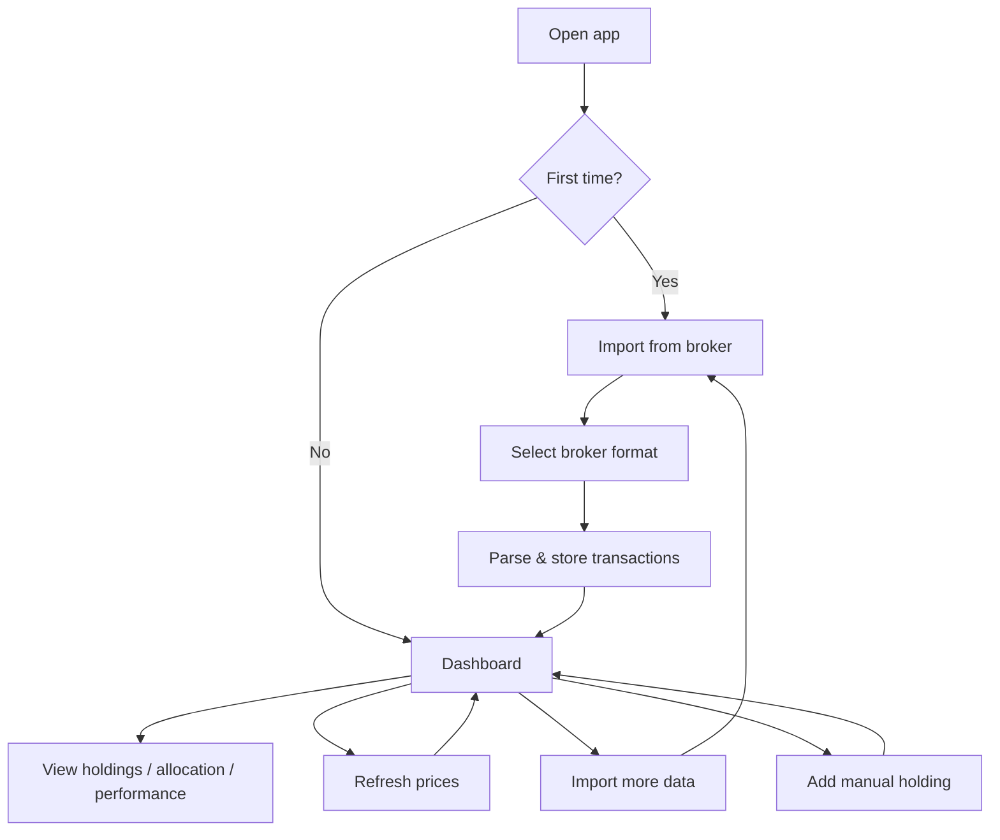

# Portfolio Tracker — MVP Scope

## Problem Frame

The user's investment portfolio is scattered across multiple brokers (Interactive Brokers,
Lightyear, and potentially others). There is no single consolidated view of holdings, allocation,
or performance. Existing tools either don't support all asset types, require manual re-entry,
or don't import from the specific brokers used.

The MVP solves this by importing transaction history from broker exports and presenting
a unified dashboard with current valuations in a user-selected base currency.

## User Flow

## Requirements

**Data Import**
- R1. Import transaction history from Interactive Brokers — both CSV activity statements
  and Flex Query XML exports
- R2. Import transaction history from Lightyear CSV exports
- R3. Clean parser interface so new broker formats can be added without modifying core logic
- R4. Handle asset types present in IBKR and Lightyear exports: stocks, ETFs, bonds, crypto,
  mutual funds. Asset types without pricing sources fall back to manual valuation (R9).
- R5. Support manual entry of assets without export (real estate, private investments):
  name, currency, quantity, cost basis (total invested), current value

**Price Data**
- R6. Fetch current market prices on demand (user-triggered refresh)
- R7. Support periodic background refresh (configurable interval). On Android, uses
  WorkManager. On web, only refreshes while the tab is open.
- R8. Cover equities, ETFs, and crypto pricing via free/public APIs
- R9. For assets without market data (real estate, private, unsupported tickers),
  use the manually entered value

**Currency**
- R10. Each holding retains its native currency (no forced conversion)
- R11. User selects a base/display currency in settings
- R12. Dashboard totals and charts convert to the base currency using fetched exchange rates
- R13. Per-holding detail shows values in the holding's native currency

**Dashboard**
- R14. Show total portfolio value across all holdings and brokers (in base currency)
- R15. Show per-holding: name, quantity, current value, gain/loss (absolute + percentage).
  Gain/loss computed per transaction lot — each buy tracked separately.
- R16. Allocation breakdown by asset type (pie or donut chart)
- R17. Portfolio value chart that accumulates over time from price refresh data points.
  No historical backfill — chart builds from the first refresh onward.

**Storage & Architecture**
- R18. Local-only storage using SQLite (no server, no auth for MVP)
- R19. Data layer designed so cloud sync can be added later without rewriting the schema
- R20. Shared business logic and UI in KMP commonMain; platform-specific code only
  where necessary (file picker, background scheduling, SQLite driver)

**Platform**
- R21. Web (wasmJs) and Android as primary targets
- R22. iOS target compiles but is not a priority for MVP polish

## Success Criteria

- Can import a real IBKR activity statement (CSV or Flex Query) and a real Lightyear
  export, and see a unified dashboard with correct totals in a chosen base currency
- Price refresh updates valuations for publicly traded assets
- Usable on both web and Android without platform-specific bugs blocking core flows

## Scope Boundaries

- No user auth or multi-user support in MVP
- No server/backend — all data local
- No real-time streaming prices (on-demand + periodic refresh only)
- No automated broker API connections (imports are file-based only)
- No tax reporting or cost-basis method selection (FIFO, LIFO, etc.) — gain/loss uses
  per-lot tracking without tax optimization
- No notifications or alerts
- No historical price backfill — chart starts from first refresh

## Key Decisions

- **Local-first storage**: Simplest path to a working MVP. Schema designed with future
  sync in mind (UUIDs, timestamps, soft deletes) but no sync code ships.
- **File import over broker APIs**: Broker APIs require auth flows, rate limits, and
  maintenance. File import is universally available and sufficient for personal use.
- **Per-lot gain/loss**: Each buy transaction tracked as a separate lot. Gain/loss is
  current value minus cost per lot, aggregated. No FIFO/LIFO method selection.
- **Accumulate-over-time chart**: Portfolio value chart builds from price refresh
  snapshots rather than fetching years of historical data. Avoids API rate limit
  complexity. Chart is empty on day one but grows naturally.
- **Multi-currency with base currency**: Holdings stay in their native currency.
  Dashboard converts to a user-selected base currency for totals and charts.
- **Web + Android first**: Web gives instant access anywhere; Android covers mobile.
  iOS compiles but isn't polished for MVP.
- **Parser interface from day one**: Three import formats (IBKR CSV, IBKR Flex XML,
  Lightyear CSV) justify a clean parser contract. Not a framework — just an interface.

## Dependencies / Assumptions

- Free pricing API availability (Yahoo Finance unofficial, CoinGecko, or similar)
  — needs research during planning
- Free exchange rate API for currency conversion — needs research during planning
- IBKR and Lightyear export formats are stable enough to parse — need sample files
- SQLite on wasmJs uses browser IndexedDB under the hood (via sql.js / SQLDelight
  web-worker-driver). Browser storage can be cleared by user or browser. Acceptable
  for MVP personal use; cloud sync would resolve this longer term.

## Outstanding Questions

### Resolve Before Planning

(none)

### Deferred to Planning

- [Affects R1, R2][Needs research] Specific CSV/XML columns and formats for IBKR
  and Lightyear exports. Need sample files to design parsers.
- [Affects R6-R8][Needs research] Which free pricing API covers equities, ETFs, and
  crypto without a paid key?
- [Affects R12][Needs research] Free exchange rate API for currency conversion.
- [Affects R18-R19][Technical] SQLDelight vs other KMP SQLite libraries. Room does
  not support wasmJs. SQLDelight's wasmJs driver uses IndexedDB — verify stability
  with Kotlin 2.1.10.
- [Affects R16-R17][Technical] Charting library for Compose Multiplatform on both
  wasmJs and Android. Ecosystem is thin — may need Canvas-based or JS interop solution.
- [Affects R4][Technical] Normalize asset representations across broker formats into
  a unified schema (ticker symbols, asset types, currencies).
- [Affects R1, R2, R21][Technical] File picker abstraction — Android uses SAF
  (`ActivityResultContracts`), web uses browser File API. Affects parser interface
  signature (likely `ByteArray` or `String` input, not file paths).
- [Affects R6-R8, R12][Technical] HTTP client setup — Ktor with platform-specific
  engines (OkHttp for Android, JS engine for wasmJs). Verify wasmJs engine stability.

## Next Steps

→ `/ce:plan` for structured implementation planning
