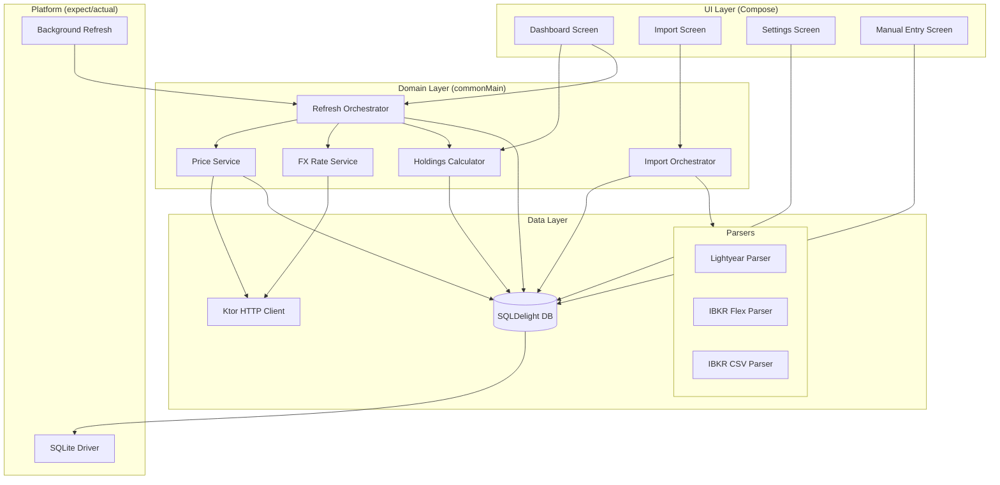
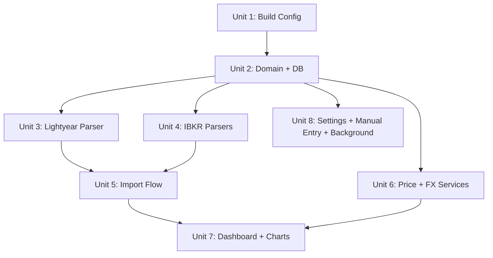

# feat: MVP Portfolio Tracker

## Overview

Build a Kotlin Multiplatform portfolio tracker that imports transaction history from
Interactive Brokers and Lightyear, fetches current prices, and shows a unified dashboard
with holdings, allocation, gain/loss, and portfolio value over time. Targets web (wasmJs)
and Android. Local-only storage, single user, multi-currency with a user-selected base
currency.

## Problem Frame

The user's portfolio is scattered across multiple brokers with no consolidated view.
Existing tools lack support for specific brokers or asset types. The MVP imports broker
exports (CSV/XML), fetches market prices, and presents everything in a single dashboard.
(see origin: `docs/brainstorms/2026-04-17-mvp-scope-requirements.md`)

## Requirements Trace

- R1. IBKR import (CSV + Flex Query XML)
- R2. Lightyear CSV import
- R3. Clean parser interface for adding broker formats
- R4. Multi-asset support (stocks, ETFs, bonds, crypto, mutual funds)
- R5. Manual entry for non-exchange assets
- R6. On-demand price refresh
- R7. Periodic background refresh (WorkManager on Android, timer on web)
- R8. Equities + ETFs + crypto pricing via free APIs
- R9. Manual valuation fallback for unsupported assets
- R10. Holdings retain native currency
- R11. User-selectable base currency
- R12. Dashboard totals in base currency via exchange rates
- R13. Per-holding detail in native currency
- R14. Total portfolio value (base currency)
- R15. Per-holding gain/loss (per-lot tracking)
- R16. Allocation breakdown chart
- R17. Portfolio value chart (accumulates from first refresh)
- R18. Local SQLite storage
- R19. Sync-ready schema design
- R20. Shared code in commonMain
- R21. Web + Android primary targets
- R22. iOS compiles, not polished

## Scope Boundaries

- No user auth or multi-user
- No server/backend
- No real-time streaming prices
- No automated broker API connections
- No tax reporting or cost-basis method selection
- No notifications or alerts
- No historical price backfill

## Context & Research

### Relevant Code and Patterns

Greenfield project — bare Compose Multiplatform scaffold. No existing business logic.

### External References

**Pricing APIs (research validated April 2026):**

| Use case | API | Key? | Limit | Notes |
|----------|-----|------|-------|-------|
| US equities + ETFs | Finnhub | Free key | 60/min | Real-time US, reliable |
| EU equities + ETFs | Yahoo Finance (unofficial REST) | None | ~2k/day soft | Best EU coverage, fragile |
| Crypto | CoinGecko | Free demo key | 30/min | Industry standard |
| Exchange rates | Frankfurter.app | None | Fair use | ECB data, ~30 currencies |

~56 API calls/day for a 50-position portfolio — trivial for all free tiers. On-demand
refresh should throttle Finnhub calls (~100ms delay between requests) to stay within
60/min burst limit when a user refreshes a large portfolio multiple times.

All three APIs (Finnhub, CoinGecko, Frankfurter) return `Access-Control-Allow-Origin: *`
headers, so browser-based fetch from wasmJs works without a proxy.

**Broker Export Formats:**

- **IBKR CSV**: Multi-section document, not flat CSV. Each row starts with section name +
  row type (Header/Data/Total). Trades section has embedded commas in datetime fields.
  Requires state-machine parser. DataDiscriminator filtering needed to avoid double-counting.
  May be UTF-8 or Windows-1252 encoded (European characters in stock names).
- **IBKR Flex XML**: Well-formed XML with ISIN on every element. Strongly preferred for
  programmatic import. Easier to parse than CSV.
- **Lightyear CSV**: Simple flat CSV. `Date,Type,Ticker,Name,Shares,Price per share,...`
  European date format (DD/MM/YYYY). No ISIN — ticker only.

**Parser architecture** (pattern from Ghostfolio/Portfolio Performance):
`BrokerParser` interface → `canParse()` + `parse()` → unified `ImportedTransaction` list.
Auto-detect format via content sniffing. Warnings over hard failures. Deterministic
transaction IDs for idempotent re-import.

**KMP Libraries (Kotlin 2.2.20 target):**

| Library | Version | wasmJs | Purpose |
|---------|---------|--------|---------|
| SQLDelight | ~2.2.x | web-worker-driver (sql.js) | Local DB |
| Ktor | ~3.2.x | ktor-client-js (fetch API) | HTTP client |
| kotlinx-serialization | ~1.9.x | Yes | JSON parsing |
| kotlinx-datetime | ~0.7.x | Yes | Date handling |
| Koala Plot | ~0.10.x | Yes | Charts |
| FileKit | ~0.12.x | Yes | File picker |
| kotlin-csv | ~1.x | Yes | RFC 4180 CSV parsing |
| WorkManager | latest | Android only | Background scheduling |
| kotlin-test | (matches Kotlin) | Yes | Test framework |

**SQLite on wasmJs**: sql.js runs in-memory by default. SQLDelight's `WebWorkerDriver`
requires shipping a web worker JS file and the sql.js WASM binary — webpack config needed
to serve these correctly. IndexedDB persistence requires manual wiring (export DB bytes →
store in IndexedDB → reload on startup). Acceptable for MVP personal use.

**Asset normalization**: ISIN as canonical key when available (IBKR Flex provides it).
Lightyear gives ticker only — match on ticker + currency in the database. ETF vs stock
disambiguation deferred past MVP (treat all equities as STOCK).

## Key Technical Decisions

- **Kotlin 2.2.20 + Compose MP 1.9.x**: Upgraded from 2.1.10 to unlock the wasmJs
  library ecosystem (charting, file picker, latest SQLDelight/Ktor). Without this,
  charting and file picker would need custom implementations.

- **SQLDelight over Room**: Room does not support wasmJs. SQLDelight's web-worker-driver
  covers both Android and web with shared schema definitions.

- **Finnhub + Yahoo Finance + CoinGecko + Frankfurter**: Four free APIs covering US
  equities, EU equities, crypto, and FX. Finnhub for US (reliable, documented), Yahoo
  Finance for EU (best coverage, unofficial/fragile). All called via Ktor HTTP client.

- **Ktor auto-resolved engine**: Use `HttpClient { ... }` in commonMain without
  expect/actual factories. Ktor auto-selects the engine when the correct platform
  dependency is on the classpath (OkHttp for Android, JS/fetch for wasmJs). Only create
  expect/actual if platform-specific configuration is needed.

- **Per-lot gain/loss, sells reduce total quantity**: Each buy tracked as a separate lot.
  On sell, reduce total holding quantity and proportionally reduce cost basis (total
  cost * sold_qty / total_qty). No lot-assignment on sells — this is simpler than
  FIFO/LIFO and still gives accurate aggregate gain/loss. (see origin)

- **Accumulate-over-time chart**: Store portfolio value snapshots on each price refresh.
  Chart builds from day one of usage. No historical price backfill. (see origin)

- **Parser auto-detection**: Content sniffing (XML declaration → IBKR Flex, section
  markers → IBKR CSV, header row → Lightyear). No reliance on file extension.

- **Idempotent import**: Each transaction gets a deterministic hash (broker + date +
  symbol + quantity + price). Re-importing the same file skips already-stored records.

- **ISIN as canonical instrument key**: When available (IBKR Flex), store ISIN. When
  unavailable (Lightyear), match on ticker + currency.

- **Manual DI, simple navigation**: Four-screen MVP does not need a DI framework or
  navigation library. Use constructor injection and a simple composable-based navigation
  state holder (enum/sealed class for current screen). Extract to Koin/Voyager if
  complexity grows beyond MVP.

- **IBKR Flex XML parsing via xmlutil**: Use `pdvrieze/xmlutil` (kotlinx-serialization
  XML module) if it supports wasmJs with Kotlin 2.2.20. If not, fall back to structured
  string parsing — IBKR Flex has predictable, flat attribute-based elements that are
  amenable to regex extraction. Evaluate in Unit 4.

- **FX conversion direction**: Call Frankfurter with `from={baseCurrency}`. This returns
  "1 base = X foreign" for all currencies. To convert a holding from foreign to base:
  `value_base = value_foreign / rate`. Cache rates for the day.

## Open Questions

### Resolved During Planning

- **Charting library**: Koala Plot — works on wasmJs with Kotlin 2.2.20, supports
  line and pie charts needed for allocation and portfolio value.
- **File picker**: FileKit — cross-platform file picker that works on wasmJs and
  Android with Kotlin 2.2.20.
- **SQLite library**: SQLDelight — only viable KMP option with wasmJs support.
- **IBKR CSV parsing approach**: State-machine parser that reads line-by-line, switches
  on section name, maintains current section's column mapping. Filter to Data rows only.
  Use kotlin-csv library for RFC 4180 compliance (handles quoted fields, embedded commas).
- **Price API selection**: Finnhub (US equities), Yahoo Finance (EU equities), CoinGecko
  (crypto), Frankfurter.app (FX).
- **Sell-lot matching**: Sells reduce total quantity proportionally across cost basis.
  No individual lot assignment — simpler and sufficient without tax optimization.
- **Navigation/DI**: Manual constructor injection + simple screen state enum. No
  framework for MVP.

### Deferred to Implementation

- Exact SQLDelight, Ktor, and Compose MP versions compatible with Kotlin 2.2.20 —
  verify during build config unit. If any library is incompatible, check the next
  minor version of Kotlin (2.2.21, 2.3.x).
- wasmJs IndexedDB persistence wiring for sql.js — needs implementation-time discovery
  to confirm approach with current SQLDelight web-worker-driver
- xmlutil wasmJs support — verify during Unit 4. If unsupported, use string parsing.
- Webpack configuration for sql.js web worker and WASM binary serving on wasmJs

## High-Level Technical Design

> *This illustrates the intended approach and is directional guidance for review, not
> implementation specification. The implementing agent should treat it as context, not
> code to reproduce.*

### Database Schema (directional)

Core tables:
- `instrument` — UUID PK (TEXT), isin, ticker, name, asset_class, currency, exchange,
  created_at, updated_at. ISIN is nullable (Lightyear imports may lack it).
- `transaction` — UUID PK (TEXT), instrument_id FK, broker_source, type (BUY/SELL/
  DIVIDEND/FEE/DEPOSIT/WITHDRAWAL), date, quantity, price_per_unit, total_amount,
  currency, fee, fx_rate, import_hash (deterministic, for dedup), notes, created_at
- `price_snapshot` — instrument_id FK, date, price, currency, source, fetched_at
- `portfolio_snapshot` — date, total_value_base, base_currency (one row per refresh,
  powers the accumulate-over-time chart)
- `settings` — key/value store (base_currency, refresh_interval, api_keys, etc.)

Sync-ready design (R19): UUID primary keys and created_at/updated_at timestamps on
mutable tables. No soft deletes — hard deletes are simpler for a single-user local app,
and a future sync layer can add its own conflict resolution. No sync logic ships.

## Implementation Units

- [ ] **Unit 1: Build Config + Dependencies**

**Goal:** Upgrade Kotlin/Compose versions and add all library dependencies so subsequent
units can use them immediately.

**Requirements:** R20, R21, R22

**Dependencies:** None

**Files:**
- Modify: `build.gradle.kts`
- Modify: `composeApp/build.gradle.kts`
- Modify: `gradle/libs.versions.toml`
- Modify: `settings.gradle.kts`
- Modify: `gradle/wrapper/gradle-wrapper.properties` (Gradle version if needed)
- Test: build compilation on Android + wasmJs targets

**Approach:**
- Upgrade Kotlin to 2.2.20 and Compose Multiplatform to a compatible 1.9.x version
- Add to version catalog: SQLDelight, Ktor (core + content-negotiation + serialization +
  OkHttp + JS engines), kotlinx-serialization, kotlinx-datetime, Koala Plot, FileKit,
  kotlin-csv, WorkManager (androidMain only)
- Add `kotlin-test` to commonTest dependencies
- Add SQLDelight Gradle plugin to root build.gradle.kts
- Configure SQLDelight database in composeApp module (database name, package, dialect)
- Add platform-specific SQLite driver dependencies (android-driver, web-worker-driver)
- Configure webpack for sql.js web worker file and WASM binary serving (wasmJs target)
- Verify the project compiles for all three targets (Android, wasmJs, iOS)
- If any library version is incompatible with Kotlin 2.2.20, check the next compatible
  version and document the resolution

**Patterns to follow:**
- Existing version catalog structure in `gradle/libs.versions.toml`

**Test scenarios:**
- Happy path: project compiles for androidDebug target without errors
- Happy path: project compiles for wasmJsBrowserDevelopmentExecutableDistribution
  without errors
- Happy path: iOS framework compiles (linkDebugFrameworkIosSimulatorArm64)
- Edge case: verify no dependency resolution conflicts between Kotlin 2.2.20 and all
  declared library versions

**Verification:**
- `./gradlew composeApp:compileKotlinAndroid` succeeds
- `./gradlew composeApp:compileKotlinWasmJs` succeeds
- `./gradlew composeApp:linkDebugFrameworkIosSimulatorArm64` succeeds
- `./gradlew composeApp:allTests` runs (even if no tests exist yet)

---

- [ ] **Unit 2: Domain Models + Database Schema**

**Goal:** Define the core domain types and SQLDelight schema that all other units build on.

**Requirements:** R4, R10, R15, R18, R19

**Dependencies:** Unit 1

**Files:**
- Create: `composeApp/src/commonMain/kotlin/app/portfoliotracker/domain/model/AssetClass.kt`
- Create: `composeApp/src/commonMain/kotlin/app/portfoliotracker/domain/model/Instrument.kt`
- Create: `composeApp/src/commonMain/kotlin/app/portfoliotracker/domain/model/Transaction.kt`
- Create: `composeApp/src/commonMain/kotlin/app/portfoliotracker/domain/model/TransactionType.kt`
- Create: `composeApp/src/commonMain/kotlin/app/portfoliotracker/domain/model/Holding.kt`
- Create: `composeApp/src/commonMain/kotlin/app/portfoliotracker/domain/model/PriceSnapshot.kt`
- Create: `composeApp/src/commonMain/kotlin/app/portfoliotracker/domain/model/PortfolioSnapshot.kt`
- Create: `composeApp/src/commonMain/sqldelight/app/portfoliotracker/PortfolioDatabase.sq`
- Create: `composeApp/src/commonMain/kotlin/app/portfoliotracker/data/database/DatabaseFactory.kt`
- Create: `composeApp/src/androidMain/kotlin/app/portfoliotracker/data/database/AndroidDatabaseDriver.kt`
- Create: `composeApp/src/wasmJsMain/kotlin/app/portfoliotracker/data/database/WebDatabaseDriver.kt`
- Create: `composeApp/src/iosMain/kotlin/app/portfoliotracker/data/database/IosDatabaseDriver.kt`
- Test: `composeApp/src/commonTest/kotlin/app/portfoliotracker/domain/model/HoldingTest.kt`

**Approach:**
- Domain models are plain Kotlin data classes in commonMain — no framework annotations
- `Holding` is computed from transactions: aggregate buy lots per instrument, compute
  current value and gain/loss. This is a pure function, not a DB entity.
- `AssetClass` enum: STOCK, ETF, BOND, MUTUAL_FUND, CRYPTO, REAL_ESTATE, PRIVATE, OTHER
- `TransactionType` enum: BUY, SELL, DIVIDEND, FEE, DEPOSIT, WITHDRAWAL, INTEREST,
  CORPORATE_ACTION
- SQLDelight .sq file defines tables: instrument, transaction, price_snapshot,
  portfolio_snapshot, settings
- UUID PKs as TEXT columns, timestamps as INTEGER (epoch millis), created_at/updated_at
  on mutable tables. Hard deletes (no soft delete columns).
- Sell handling: sells reduce total holding quantity. Cost basis reduced proportionally
  (total_cost * sold_qty / total_qty). No individual lot assignment on sells.
- Platform-specific driver creation via expect/actual `DatabaseDriverFactory`
- Android driver: `AndroidSqliteDriver`
- wasmJs driver: `WebWorkerDriver` with sql.js — in-memory for initial unit, IndexedDB
  persistence wired in Unit 8
- iOS driver: `NativeSqliteDriver`

**Patterns to follow:**
- SQLDelight documentation for KMP multi-driver setup

**Test scenarios:**
- Happy path: `Holding.fromTransactions()` correctly aggregates 3 buy lots into a single
  holding with total quantity and total invested
- Happy path: `Holding.fromTransactions()` with a BUY (100 shares @ $10) + partial SELL
  (50 shares) → quantity 50, cost basis reduced proportionally ($500)
- Edge case: `Holding.fromTransactions()` with only SELL transactions → zero or negative
  quantity holding (represents a short or error state)
- Edge case: `Holding.fromTransactions()` with zero transactions → null holding
- Happy path: gain/loss calculation — holding with cost basis 1000, current value 1200
  → gain 200 (20%)

**Verification:**
- Domain model tests pass
- SQLDelight schema generates without errors
- App still compiles for all targets

---

- [ ] **Unit 3: Parser Framework + Lightyear CSV Parser**

**Goal:** Define the parser interface and implement the simplest parser (Lightyear) to
prove the architecture.

**Requirements:** R2, R3, R4

**Dependencies:** Unit 2

**Files:**
- Create: `composeApp/src/commonMain/kotlin/app/portfoliotracker/data/parser/BrokerParser.kt`
- Create: `composeApp/src/commonMain/kotlin/app/portfoliotracker/data/parser/ParseResult.kt`
- Create: `composeApp/src/commonMain/kotlin/app/portfoliotracker/data/parser/ImportedTransaction.kt`
- Create: `composeApp/src/commonMain/kotlin/app/portfoliotracker/data/parser/LightyearCsvParser.kt`
- Test: `composeApp/src/commonTest/kotlin/app/portfoliotracker/data/parser/LightyearCsvParserTest.kt`

**Approach:**
- `BrokerParser` interface: `formatId: String`, `canParse(content: String): Boolean`,
  `parse(content: String): ParseResult`
- `ParseResult`: list of `ImportedTransaction`, list of warnings, skipped row count
- `ImportedTransaction`: broker source, date, type, ticker, isin (nullable), name,
  quantity, price, total amount, currency, fee, fx rate, notes. This is a parser-output
  DTO, not a domain model — mapping to domain `Transaction` happens in the import
  orchestrator.
- `canParse()` for Lightyear: check if first line matches expected header columns
  (`Date,Type,Ticker,...`)
- Use kotlin-csv library for RFC 4180 compliant CSV reading
- Parse Lightyear CSV line-by-line. Handle DD/MM/YYYY dates. Map Type column to
  transaction type. Fractional shares. Empty ticker/shares for cash transactions.
- Collect warnings for unparseable rows instead of failing the entire import

**Patterns to follow:**
- Ghostfolio/Portfolio Performance pattern: parsers are stateless, take string input,
  return structured output. No database access inside parsers.

**Test scenarios:**
- Happy path: parse a valid Lightyear CSV with 5 BUY transactions → 5 ImportedTransactions
  with correct tickers, quantities, prices, and dates
- Happy path: parse DIVIDEND and DEPOSIT rows → correct transaction types
- Happy path: `canParse()` returns true for valid Lightyear header, false for IBKR content
- Edge case: CSV with only a header row and no data → empty transaction list, no warnings
- Edge case: row with missing Ticker (cash transaction like DEPOSIT) → parsed correctly
  with null ticker
- Edge case: fractional shares (0.5432) → parsed as correct decimal
- Error path: row with malformed date (e.g., `31/13/2025`) → warning added, row skipped,
  remaining rows still parsed
- Error path: completely non-CSV content (binary file) → `canParse()` returns false
- Error path: CSV with extra/missing columns → warning per row, best-effort parsing

**Verification:**
- All parser tests pass
- Parser handles real-world Lightyear CSV structure (validated against format docs)

---

- [ ] **Unit 4: IBKR Parsers (Flex XML + CSV)**

**Goal:** Implement the two IBKR parsers. Flex XML first (simpler, richer data), then CSV
(state-machine parser for multi-section format).

**Requirements:** R1, R3, R4

**Dependencies:** Unit 2 (domain models), Unit 3 (parser interface)

**Files:**
- Create: `composeApp/src/commonMain/kotlin/app/portfoliotracker/data/parser/IbkrFlexXmlParser.kt`
- Create: `composeApp/src/commonMain/kotlin/app/portfoliotracker/data/parser/IbkrCsvParser.kt`
- Test: `composeApp/src/commonTest/kotlin/app/portfoliotracker/data/parser/IbkrFlexXmlParserTest.kt`
- Test: `composeApp/src/commonTest/kotlin/app/portfoliotracker/data/parser/IbkrCsvParserTest.kt`

**Approach:**

*Flex XML parser:*
- `canParse()`: check for `<FlexQueryResponse` or XML declaration + FlexStatements
- First try `pdvrieze/xmlutil` (kotlinx-serialization XML module) — check if it supports
  wasmJs with the project's Kotlin version. If yes, deserialize `<Trade>` and
  `<CashTransaction>` elements via data classes. If xmlutil doesn't support wasmJs,
  fall back to structured string/regex parsing: IBKR Flex elements are flat
  (single-element with attributes, no deep nesting), making regex extraction viable.
  Extract attributes by name from self-closing `<Trade ... />` elements.
- Extract `<Trade>` elements: symbol, isin, assetCategory, dateTime (semicolon-separated),
  quantity, tradePrice, ibCommission, buySell, levelOfDetail
- Filter to `levelOfDetail="EXECUTION"` to avoid double-counting
- Extract `<CashTransaction>` elements for dividends, fees, interest
- Map assetCategory (STK, OPT, BOND, CRYPTO, FUND, CASH) to domain AssetClass

*CSV parser:*
- State-machine: read line-by-line using kotlin-csv library (handles quoted fields and
  embedded commas in datetime correctly), parse first two columns (section name, row type)
- On `Header` row: store column mapping for current section
- On `Data` row: parse using current section's column mapping
- Skip `Total`/`SubTotal` rows
- Focus on Trades, Dividends, Withholding Tax, and Financial Instrument Information sections
- Financial Instrument Information section provides symbol → ISIN mapping
- `canParse()`: check if early lines contain known section names (`Statement,Header` etc.)

*Encoding:*
- Both parsers accept String input. The import orchestrator (Unit 5) handles encoding
  detection when converting file bytes to String.

**Patterns to follow:**
- Portfolio Performance's IBKR CSV state-machine approach
- Same `BrokerParser` interface and `ParseResult` output as Lightyear parser

**Test scenarios:**

*Flex XML:*
- Happy path: parse XML with 3 trades (2 BUY, 1 SELL) → 3 transactions with correct
  ISINs, quantities, prices, and dates
- Happy path: parse CashTransaction dividends → DIVIDEND type transactions
- Happy path: `canParse()` returns true for Flex XML, false for CSV and Lightyear content
- Edge case: trade with `levelOfDetail="ORDER"` and `levelOfDetail="EXECUTION"` for same
  trade → only EXECUTION included
- Edge case: multi-currency trades (USD + EUR) → each transaction retains its currency
- Error path: malformed XML (unclosed tag) → warning, partial results returned

*CSV:*
- Happy path: parse multi-section CSV with Trades + Dividends → correct transactions
  extracted from both sections
- Happy path: Financial Instrument Information section provides ISIN → trades get ISIN
  populated from cross-reference
- Edge case: datetime with embedded comma (`2024-01-15, 09:30:00`) → parsed correctly
  via kotlin-csv quoted field handling
- Edge case: section with Header row but no Data rows → skipped cleanly
- Edge case: DataDiscriminator filtering → only Trade or Order rows, not ClosedLot
- Error path: CSV with unknown section name → section skipped with warning

**Verification:**
- All IBKR parser tests pass
- Both parsers handle representative IBKR export structures

---

- [ ] **Unit 5: Import Flow (Orchestration + File Picker + UI)**

**Goal:** Wire up the full import pipeline: user picks a file → auto-detect format →
parse → deduplicate → persist to database. Build the import screen UI.

**Requirements:** R1, R2, R3, R20, R21

**Dependencies:** Unit 3 (Lightyear parser), Unit 4 (IBKR parsers)

**Files:**
- Create: `composeApp/src/commonMain/kotlin/app/portfoliotracker/data/import/ImportOrchestrator.kt`
- Create: `composeApp/src/commonMain/kotlin/app/portfoliotracker/data/repository/TransactionRepository.kt`
- Create: `composeApp/src/commonMain/kotlin/app/portfoliotracker/data/repository/InstrumentRepository.kt`
- Create: `composeApp/src/commonMain/kotlin/app/portfoliotracker/ui/import/ImportScreen.kt`
- Create: `composeApp/src/commonMain/kotlin/app/portfoliotracker/ui/import/ImportViewModel.kt`
- Test: `composeApp/src/commonTest/kotlin/app/portfoliotracker/data/import/ImportOrchestratorTest.kt`

**Approach:**
- `ImportOrchestrator` handles everything: format detection (iterate parsers, call
  `canParse()`, return first match or error), parsing, mapping `ImportedTransaction` to
  domain `Transaction`, instrument resolution, hash computation, dedup, and persistence.
  No separate `FormatDetector` or `TransactionMapper` classes — this logic is private
  to the orchestrator until a second consumer needs it.
- Instrument resolution: match by ISIN first, then ticker + currency. Create new
  instrument if not found.
- Import hash: deterministic hash of (broker_source + date + ticker + quantity + price)
  stored on each transaction. Duplicate detection via hash lookup before insert.
- Encoding: convert file bytes to String trying UTF-8 first. If parsing produces garbled
  characters (common with IBKR Windows-1252 exports), retry with ISO-8859-1/Windows-1252.
  On wasmJs, use `TextDecoder` API.
- FileKit for platform file picking — returns file content as ByteArray
- Import screen UI: "Select file" button → file picker → progress/result display with
  count of imported transactions and any warnings
- Navigation: accessible from dashboard via "Import" action

**Patterns to follow:**
- Ghostfolio pattern: separate parsing from persistence
- Repository pattern for database access

**Test scenarios:**
- Happy path: import a Lightyear CSV → correct number of transactions persisted,
  instruments created, import result shows success count
- Happy path: import an IBKR Flex XML → transactions and instruments persisted correctly
- Happy path: format auto-detection correctly identifies all three formats
- Happy path: importing creates instruments that don't exist yet, reuses existing ones
  that match by ISIN or ticker+currency
- Edge case: re-import same file → zero new transactions (all deduplicated by hash)
- Edge case: import file with some new and some existing transactions → only new ones
  added, duplicates reported in result
- Edge case: empty file content → "unrecognized format" error, no data changed
- Error path: unrecognized file format → user-facing error message, no data changed
- Error path: file with parser warnings → import succeeds for valid rows, warnings
  displayed to user
- Integration: full pipeline from file content bytes → encoding → parser → orchestrator
  → repository → database query confirms data stored correctly

**Verification:**
- Import orchestrator tests pass
- Can select a file on both Android and web, see import results in UI

---

- [ ] **Unit 6: Price + FX Services**

**Goal:** Fetch current market prices and exchange rates via HTTP APIs. Store price
snapshots. Enable manual refresh from the dashboard.

**Requirements:** R6, R8, R9, R10, R12

**Dependencies:** Unit 2 (database, domain models)

**Files:**
- Create: `composeApp/src/commonMain/kotlin/app/portfoliotracker/data/pricing/PriceService.kt`
- Create: `composeApp/src/commonMain/kotlin/app/portfoliotracker/data/pricing/FinnhubClient.kt`
- Create: `composeApp/src/commonMain/kotlin/app/portfoliotracker/data/pricing/YahooFinanceClient.kt`
- Create: `composeApp/src/commonMain/kotlin/app/portfoliotracker/data/pricing/CoinGeckoClient.kt`
- Create: `composeApp/src/commonMain/kotlin/app/portfoliotracker/data/pricing/FxRateService.kt`
- Create: `composeApp/src/commonMain/kotlin/app/portfoliotracker/data/pricing/PriceRepository.kt`
- Create: `composeApp/src/commonMain/kotlin/app/portfoliotracker/data/pricing/RefreshOrchestrator.kt`
- Test: `composeApp/src/commonTest/kotlin/app/portfoliotracker/data/pricing/PriceServiceTest.kt`
- Test: `composeApp/src/commonTest/kotlin/app/portfoliotracker/data/pricing/RefreshOrchestratorTest.kt`

**Approach:**
- Create Ktor `HttpClient` in commonMain with JSON content negotiation via
  kotlinx-serialization. Use Ktor's auto-resolved engine (OkHttp on Android,
  JS/fetch on wasmJs) — no expect/actual factories unless platform-specific config
  is needed.
- `FinnhubClient`: GET `https://finnhub.io/api/v1/quote?symbol={ticker}` with API key
  header. Returns current price (`c` field). Call sequentially with ~100ms delay between
  requests to stay within 60/min burst limit.
- `YahooFinanceClient`: GET Yahoo Finance v8 chart/quote endpoint for EU equities.
  Use this for tickers not covered by Finnhub (non-US exchanges). No API key needed.
  Return null/warning if endpoint is unavailable (fragile, unofficial).
- `CoinGeckoClient`: GET `/api/v3/simple/price?ids={ids}&vs_currencies=usd` — batch
  endpoint supports up to 250 coins per call.
- `FxRateService`: GET `https://api.frankfurter.app/latest?from={baseCurrency}` — returns
  rates as "1 base = X foreign". To convert foreign to base: `value_base = value_foreign
  / rate`. Cache rates for the day (ECB updates daily).
- `PriceService` orchestrates pricing: classify instruments by asset class → route to
  correct API client (equities → Finnhub/Yahoo, crypto → CoinGecko). Store results in
  price_snapshot table.
- `RefreshOrchestrator` coordinates a full refresh cycle: call PriceService → call
  FxRateService → compute total portfolio value (using HoldingsCalculator from Unit 7,
  or a lightweight version here) → record portfolio_snapshot row. This avoids
  circular dependency between PriceService and HoldingsCalculator — the orchestrator
  sits above both.
- For instruments without API coverage (R9): skip, retain last manual/import value
- API keys stored in local settings (user enters once in Settings screen)

**Patterns to follow:**
- Ktor KMP client with auto-resolved engine

**Test scenarios:**
- Happy path: refresh prices for a portfolio with 3 stocks + 1 crypto → 4 price
  snapshots stored with correct prices and timestamps
- Happy path: FX rate fetch returns rates → convert holding in USD to EUR base
  correctly (USD value / EUR-to-USD rate)
- Happy path: portfolio snapshot recorded after refresh → total value in base currency
  stored with date
- Edge case: instrument with no ticker (manual entry) → skipped during price fetch,
  retains manually entered value
- Edge case: API returns no data for a ticker (delisted, wrong symbol) → warning logged,
  instrument retains last known price
- Edge case: EU equity not found in Finnhub → falls back to Yahoo Finance
- Error path: Finnhub API unreachable (network error) → graceful failure, stale prices
  retained, user sees error message
- Error path: CoinGecko rate limit hit → partial refresh completes for already-fetched
  prices, remaining marked as stale
- Error path: Yahoo Finance endpoint broken → fallback to last known price, warning
  surfaced
- Integration: price refresh → price_snapshot persisted → portfolio_snapshot recorded →
  both queryable from database

**Verification:**
- Price service tests pass (with mocked HTTP responses)
- Manual refresh button triggers full price update cycle on both platforms
- CORS works for all three APIs when called from wasmJs browser context

---

- [ ] **Unit 7: Dashboard + Charts**

**Goal:** Build the main dashboard screen showing total portfolio value, holdings list
with gain/loss, allocation pie chart, and portfolio value over time chart.

**Requirements:** R12, R13, R14, R15, R16, R17, R20

**Dependencies:** Unit 5 (import flow — data in DB), Unit 6 (price + FX services)

**Files:**
- Create: `composeApp/src/commonMain/kotlin/app/portfoliotracker/domain/HoldingsCalculator.kt`
- Create: `composeApp/src/commonMain/kotlin/app/portfoliotracker/ui/dashboard/DashboardScreen.kt`
- Create: `composeApp/src/commonMain/kotlin/app/portfoliotracker/ui/dashboard/DashboardViewModel.kt`
- Create: `composeApp/src/commonMain/kotlin/app/portfoliotracker/ui/dashboard/HoldingsList.kt`
- Create: `composeApp/src/commonMain/kotlin/app/portfoliotracker/ui/dashboard/AllocationChart.kt`
- Create: `composeApp/src/commonMain/kotlin/app/portfoliotracker/ui/dashboard/PortfolioValueChart.kt`
- Create: `composeApp/src/commonMain/kotlin/app/portfoliotracker/ui/navigation/AppNavigation.kt`
- Modify: `composeApp/src/commonMain/kotlin/app/portfoliotracker/App.kt`
- Test: `composeApp/src/commonTest/kotlin/app/portfoliotracker/domain/HoldingsCalculatorTest.kt`

**Approach:**
- `HoldingsCalculator`: pure function that takes transactions + latest prices + FX rates
  + base currency → returns list of `Holding` objects with current value, gain/loss
  (per-lot), and allocation percentage. Also returns total portfolio value in base currency.
- Base currency defaults to EUR (hardcoded default). When Unit 8 ships settings, the
  dashboard reads from SettingsRepository instead.
- `AppNavigation`: simple sealed class/enum for screen state (Dashboard, Import, Settings,
  ManualEntry). No navigation library — just a `when` on the current screen state in
  `App.kt`. Import screen from Unit 5 wired in here.
- `DashboardScreen`: top-level composable with:
  - Total portfolio value (big number, base currency)
  - Refresh prices button (triggers RefreshOrchestrator from Unit 6)
  - Holdings list (scrollable, each row: name, ticker, quantity, value in native currency,
    gain/loss absolute + %, allocation %)
  - Allocation pie chart by asset class (Koala Plot pie chart)
  - Portfolio value over time line chart (Koala Plot line chart, data from
    portfolio_snapshot table)
- Currency display: totals and charts in base currency, per-holding detail in native
  currency with base currency equivalent

**Patterns to follow:**
- Compose Multiplatform simple state holder (no ViewModel library needed)
- Koala Plot API for pie and line charts

**Test scenarios:**
- Happy path: 5 holdings across 2 currencies → `HoldingsCalculator` returns correct
  total in base currency, per-holding gain/loss, and allocation percentages summing to 100%
- Happy path: per-lot gain/loss — holding with 2 buy lots at different prices → gain/loss
  reflects proportional cost basis reduction vs current price
- Happy path: FX conversion — holding worth 1000 USD, base currency EUR, rate 1.08 →
  value_base = 1000 / 1.08 ≈ 925.93 EUR
- Edge case: holding with zero current price (no price snapshot yet) → shows last known
  value or "N/A"
- Edge case: portfolio with only manually valued assets (no price API) → total based on
  manual valuations
- Edge case: single holding → allocation is 100%, pie chart shows one segment
- Edge case: no portfolio snapshots yet → value chart shows "No data yet" placeholder
- Error path: FX rate unavailable for a currency → holding shown in native currency,
  excluded from base currency total or uses last known rate

**Verification:**
- Holdings calculator tests pass
- Dashboard renders on both Android and web with holdings, charts, and correct totals

---

- [ ] **Unit 8: Settings + Manual Entry + Background Refresh**

**Goal:** Complete the remaining MVP features: base currency selection, manual holding
CRUD, and periodic background price refresh.

**Requirements:** R5, R7, R9, R11

**Dependencies:** Unit 2 (database), Unit 6 (price service / RefreshOrchestrator)

**Files:**
- Create: `composeApp/src/commonMain/kotlin/app/portfoliotracker/ui/settings/SettingsScreen.kt`
- Create: `composeApp/src/commonMain/kotlin/app/portfoliotracker/ui/settings/SettingsViewModel.kt`
- Create: `composeApp/src/commonMain/kotlin/app/portfoliotracker/ui/manual/ManualEntryScreen.kt`
- Create: `composeApp/src/commonMain/kotlin/app/portfoliotracker/ui/manual/ManualEntryViewModel.kt`
- Create: `composeApp/src/commonMain/kotlin/app/portfoliotracker/data/repository/SettingsRepository.kt`
- Create: `composeApp/src/androidMain/kotlin/app/portfoliotracker/platform/BackgroundRefreshWorker.kt`
- Create: `composeApp/src/wasmJsMain/kotlin/app/portfoliotracker/platform/WebBackgroundRefresh.kt`
- Create: `composeApp/src/commonMain/kotlin/app/portfoliotracker/platform/BackgroundRefresh.kt`
- Modify: `composeApp/src/commonMain/kotlin/app/portfoliotracker/ui/dashboard/DashboardViewModel.kt`
- Test: `composeApp/src/commonTest/kotlin/app/portfoliotracker/data/repository/SettingsRepositoryTest.kt`

**Approach:**

*Settings:*
- Settings screen: base currency picker (dropdown with common currencies: EUR, USD, GBP,
  HUF, CHF, etc.), refresh interval selector (manual only, daily, weekly), API key fields
  (Finnhub, CoinGecko)
- `SettingsRepository`: reads/writes key-value pairs from settings table
- Base currency defaults to EUR on first launch
- Update DashboardViewModel to read base currency from SettingsRepository instead of
  hardcoded default

*Manual entry:*
- Form: name, asset class (dropdown), currency, quantity, cost basis (total invested),
  current estimated value, notes
- Creates an instrument (asset_class = REAL_ESTATE/PRIVATE/OTHER) + a BUY transaction
- Manual entry instruments use R9 — price service skips them, they retain the entered value
- Edit/delete existing manual entries (hard delete)

*Background refresh:*
- expect/actual `BackgroundRefresh` interface
- Android: `WorkManager` periodic work request at user-configured interval. Worker calls
  `RefreshOrchestrator.refreshAll()`.
- wasmJs: `setInterval` — only runs while tab is open. Clear interval on
  page unload to avoid duplicate timers on re-open.
- Refresh interval configurable via settings (default: daily)

**Patterns to follow:**
- Android WorkManager periodic work pattern
- expect/actual for platform-specific background scheduling

**Test scenarios:**

*Settings:*
- Happy path: set base currency to USD → stored in settings, retrieved correctly on
  next read
- Happy path: set refresh interval to daily → stored correctly
- Edge case: no settings stored yet → defaults applied (EUR base currency, manual refresh)

*Manual entry:*
- Happy path: create manual entry for "Apartment" (REAL_ESTATE, EUR, value 200000) →
  instrument + BUY transaction persisted, appears in dashboard holdings
- Happy path: edit manual entry value → transaction updated, dashboard reflects new value
- Happy path: delete manual entry → instrument and transaction deleted, removed from
  dashboard
- Edge case: manual entry with zero value → accepted (valid for tracking without valuation)

*Background refresh:*
- Happy path: Android WorkManager schedules periodic work at configured interval
- Edge case: web tab closed and reopened → new setInterval started, no duplicate timers
- Integration: background refresh triggers RefreshOrchestrator.refreshAll() → prices
  updated and portfolio snapshot recorded

**Verification:**
- Settings persist and restore across app restarts
- Manual entries appear in dashboard with correct values
- Background refresh triggers automatically on Android and while tab is open on web

## System-Wide Impact

- **Interaction graph:** Import flow → parser → orchestrator → repository → database.
  RefreshOrchestrator → PriceService + FxRateService + HoldingsCalculator → snapshots.
  Dashboard reads from all repositories. Settings affect RefreshOrchestrator (API keys,
  base currency) and background refresh (interval).
- **Error propagation:** API failures (pricing, FX) should surface as user-visible
  warnings without crashing. Stale prices shown with timestamp. Parser failures return
  partial results + warnings. Database errors should propagate as exceptions to the UI
  layer.
- **State lifecycle risks:** wasmJs IndexedDB can be cleared by browser — user may lose
  data. Acceptable for MVP; warn user in settings. Re-import recovers transaction data
  but not manual entries or portfolio snapshots.
- **API surface parity:** Web and Android must support all features. Background refresh
  has degraded behavior on web (tab-foreground only) — documented and acceptable.
- **Unchanged invariants:** iOS target compiles but receives no platform-specific
  implementations for file picker, background refresh, or SQLite driver polish. It is
  not expected to be fully functional.

## Risks & Dependencies

| Risk | Mitigation |
|------|------------|
| SQLDelight wasmJs driver instability / worker setup | Test early in Unit 1. If web-worker-driver is unstable, fall back to in-memory-only SQLite on web for MVP |
| Kotlin 2.2.20 library compatibility | Verify all library versions in Unit 1. If incompatible, try Kotlin 2.2.21 or 2.3.x. Document resolutions. |
| xmlutil wasmJs support for Flex XML parsing | Test in Unit 4. Fall back to regex/string attribute extraction if unsupported. |
| Yahoo Finance unofficial API breaks | Primary use is EU equities. If unavailable, user enters manual values. Finnhub covers US. |
| CORS blocking browser API calls (wasmJs) | All three primary APIs (Finnhub, CoinGecko, Frankfurter) allow `*` origin. Verify Yahoo Finance CORS in Unit 6. If blocked, EU equities fall back to manual entry on web. |
| wasmJs IndexedDB persistence complexity | Defer to implementation discovery. If too complex, web version is session-only for MVP — warn user |
| Koala Plot wasmJs rendering issues | Test in Unit 7. Fall back to custom Canvas drawing if needed |
| IBKR CSV format variations across accounts/regions | Use representative test data. Parser emits warnings for unexpected formats rather than failing |
| File encoding (Windows-1252) | ImportOrchestrator tries UTF-8 first, retries with ISO-8859-1 on garbled output |

## Sources & References

- **Origin document:** [docs/brainstorms/2026-04-17-mvp-scope-requirements.md](docs/brainstorms/2026-04-17-mvp-scope-requirements.md)
- Pricing API docs: Finnhub (finnhub.io/docs/api), CoinGecko (coingecko.com/api/documentation), Frankfurter (frankfurter.app)
- IBKR reporting: interactivebrokers.com/en/software/reportguide/
- Ghostfolio importers: github.com/ghostfolio/ghostfolio (apps/api/src/app/import/)
- Portfolio Performance IBKR extractor: github.com/portfolio-performance/portfolio
- SQLDelight KMP docs: cashapp.github.io/sqldelight/
- Ktor client docs: ktor.io/docs/client.html
- Koala Plot: github.com/KoalaPlot/koalaplot-core
- FileKit: github.com/vinceglb/FileKit
- kotlin-csv: github.com/jsoizo/kotlin-csv
- xmlutil: github.com/pdvrieze/xmlutil
